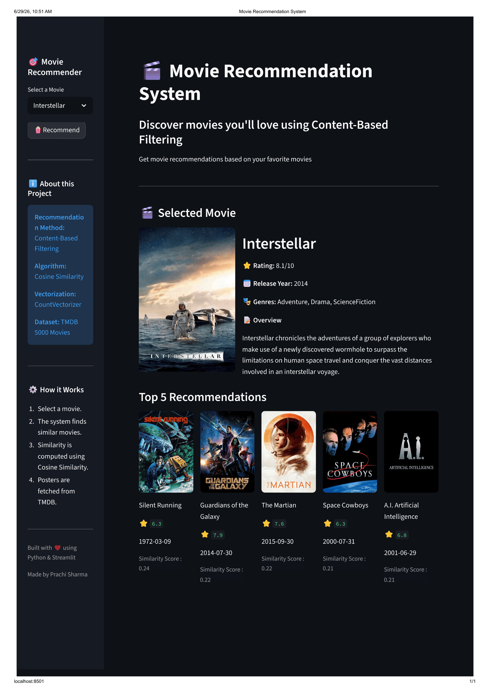
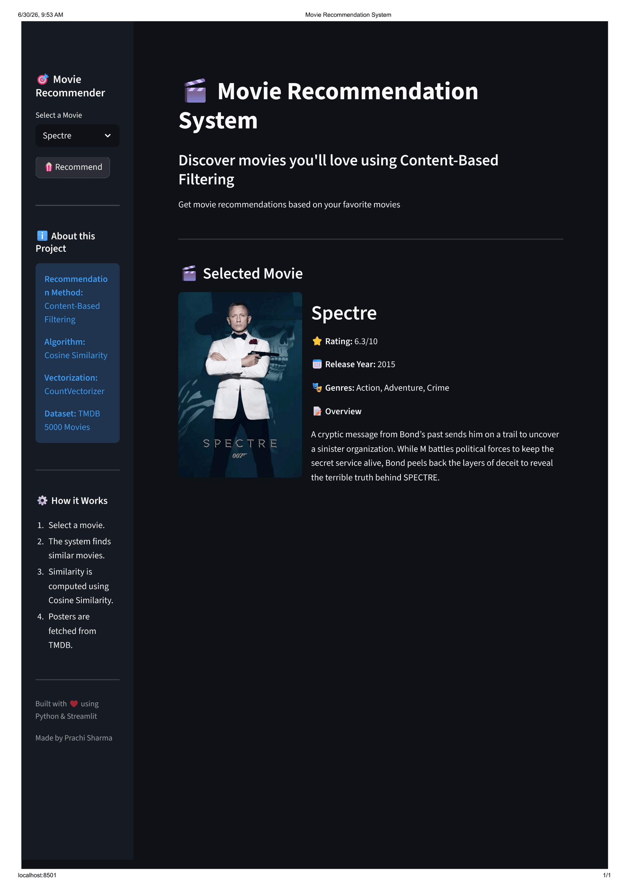
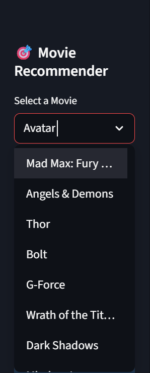
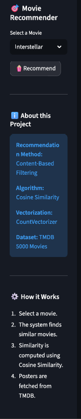
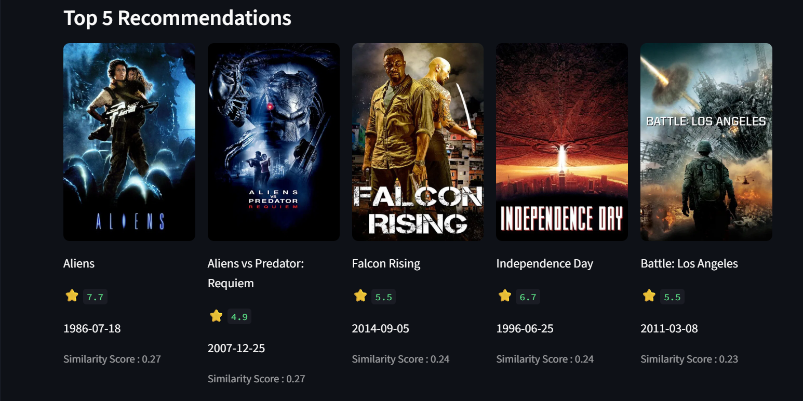

# 🎬 Movie Recommendation System

A Machine Learning-based Movie Recommendation System built using **Content-Based Filtering**. The application recommends movies similar to the user's selected movie by analyzing movie metadata such as genres, keywords, cast, crew, and overview.

The project is developed with **Python**, **Scikit-learn**, and **Streamlit**, while movie posters are fetched dynamically using the **TMDB API**.

---

## ✨ Features

* 🎬 Content-Based Movie Recommendation
* 🎯 Recommend Top 5 Similar Movies
* 🖼️ Fetch Movie Posters using TMDB API
* ⭐ Display Movie Ratings
* 📅 Display Release Year
* 🎭 Display Movie Genres
* 📝 Show Movie Overview
* 💻 Interactive Web Interface built with Streamlit

---

## 🧠 Recommendation Pipeline

1. Load the TMDB Movies and Credits datasets.
2. Merge both datasets using the movie title.
3. Perform data preprocessing:

   * Handle missing values
   * Extract genres, keywords, cast, and director
   * Remove stopwords
   * Apply stemming using NLTK
4. Create a combined **tags** column.
5. Convert text into numerical vectors using **CountVectorizer**.
6. Compute similarity between movies using **Cosine Similarity**.
7. Store the processed data as `movies.pkl` and `similarity.pkl`.
8. Build an interactive Streamlit application for movie recommendations.

---

## 🛠️ Technologies Used

* Python
* Streamlit
* Pandas
* NumPy
* Scikit-learn
* NLTK
* Requests
* TMDB API

---

## 📂 Project Structure

```text
Movie-Recommendation-System/
│
├── app.py
├── Movie Recommendation.ipynb
├── movies.pkl
├── similarity.pkl
├── tmdb_5000_movies.csv
├── tmdb_5000_credits.csv
├── requirements.txt
├── README.md
├── .gitignore
└── screenshots/
```

---

## 🚀 Installation

### 1. Clone the repository

```bash
git clone <https://github.com/Prachicode-creator/Movie_recommendation_system.git>
```

### 2. Navigate to the project directory

```bash
cd Movie-Recommendation-System
```

### 3. Install the required dependencies

```bash
pip install -r requirements.txt
```

### 4. Generate the required files

Before running the Streamlit application, open and execute the `movie_recommender.ipynb` notebook once. This will generate the required files:

* `movies.pkl`
* `similarity.pkl`

### 5. Add your TMDB API key

Open `app.py` and replace:

```python
API_KEY = "YOUR_TMDB_API_KEY"
```

with your own TMDB API key.

### 6. Run the application

```bash
streamlit run app.py
```

---

## 📸 Screenshots
### Dashboard


### Home Page


### Selected Movie



### Sidebar


### Recommendations



---

## 🔮 Future Improvements

* Hybrid Recommendation System
* User Authentication
* Personalized Recommendations
* Search History
* Watchlist Feature
* Movie Trailers
* Deployment on Cloud

---

## 👩‍💻 Author

**Prachi Sharma**

Built as a Machine Learning project using Python and Streamlit.
